# MIST4610groupproject
Group 2 Project

## Members:
1. Aaron Eason - [@aceeason](https://github.com/aceeason)
2. Kiera Lumley - [@ksl05149](https://github.com/ksl05149)
3. Navi Khan - [@NaviKhan15](https://github.com/NaviKhan15)
4. Sean Donovan - [@sean4565](https://github.com/sean4565)
5. Gilbert Fahnbulleh -
6. Steven Thomas - [@st11521](https://github.com/st11521)

## **Scenario Description**
Our groups task is to build a database to manage virtual clinic througput and insurance reimbursment. The central entity of the model is the patients. The patients are the clients that the physicians manage. Patients can interact with the model two ways by booking virtual appointments, and by getting their appointments insured. Patients work conjuctively with physicians, appointments, medical encounters, prescriptions and insurance providers. Our group wants to accurately model the patient to medical system interaction, generate sample data, and create a model that manages these relationships. We are performing queries on this data to provide business insight about the telehealth patient and provider portal.

## **Explanation of Data Model**
Our data model is designed to capture operational flow of a virtual clinic with a focus on patients and insurance processes. At the center of the system is the Patients entity, serving as the foundation for most relationships in the model. Patients are able to interact with the system mainly by scheduling virtual appointments and by having those appointments processed for insurance reimbursement. This forms two one-to-many relationships, with one between Appointments and Patients, and another from Appointments and Physicians. These two also form a many-to-many relationship between Patients and Physicians, with Appointments acting as the associative entity, reflecting the reality that a patient can see multiple specialized physicians over time, while physicians can attend care to many different patients. Physicians can also maintain structured availability, represented by the one‑to‑many relationship between Physicians and Availability, which ensures that appointments can only be scheduled during valid time windows.

After an appointment occurs, it may generate a medicalEncounter, that connects back to Patients and appointments. Each encounter represents a documented interaction, driving several downstream processes in the model which record, bill, and support the clinical meeting. From there the model branches into documentation and treatment, where Encounters form a one to one relationship with medicalRecords, which could store diagnoses and clinical details from that encounter. Then the Encounter flows into the Billing process, which captures the amount, status, and date, creating a financial picture of the services delivered.

The billing record is the base for two major downstream components of Payments and insuranceClaims. Payments connect to patients in a one to many relationship where a patient may make pay off a bill over multiple installments, recording details such as the date, method and amount, allowing the system to track partial payments. Alongside payments, the model supports insurance reimbursement through the InsuranceProvider and InsuranceClaim entities. Patients may have multiple insurance plans on file, and each billing record can generate one or more claims, reflecting real-world scenarios where primary and secondary insurance coverage may both be involved. Insurance claims store the claim type, claim amount, and the provider responsible for reviewing the claim. As each claim moves through stages such as submission, processing, approval, or denial, its outcome directly influences whether the associated bill is fully paid, partially covered, or left outstanding. 

Finally, the consentForm entity ensures that all clinical and financial activities occur within legal and ethical boundaries. Patients may sign multiple consent forms over time, each with its own type, signed date, expiration date, and status, allowing the clinic to verify that proper authorization exists before releasing records, billing insurance, or delivering certain types of care. Together, payments, insurance, and consent create a complete administrative framework that supports accurate billing, compliant reimbursement, and transparent patient authorization throughout the virtual clinic.

## **Core Entities:**
1. Appointments
2. Availabilty
3. Billing
4. consentForms
5. insuranceClaims
6. insuranceProvider
7. medicalEncounters
8. medicalRecords
9. Patients
10. Payments
11. Physicians
12. Prescriptions

## Database Model
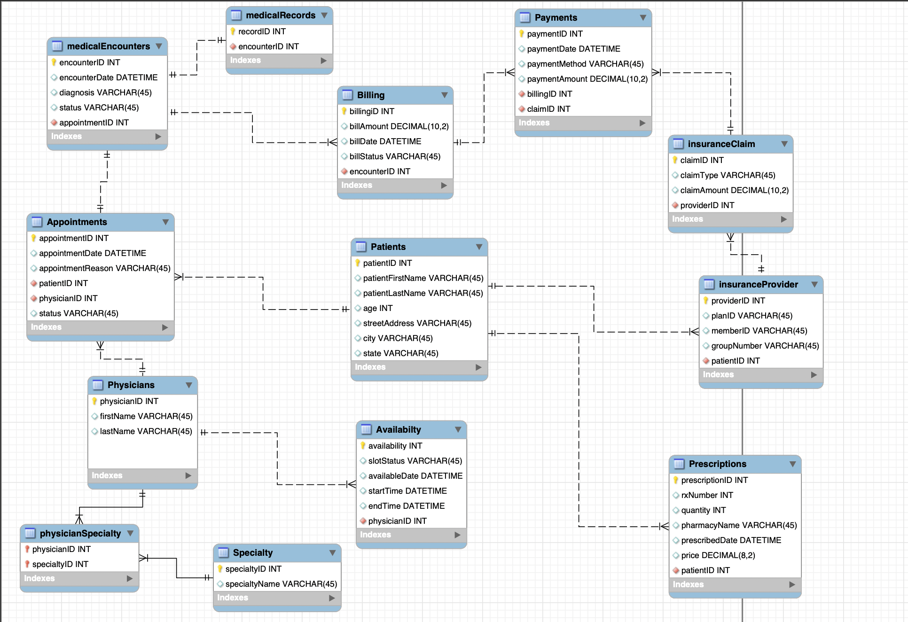

## Data Dictionary 

## Query 1
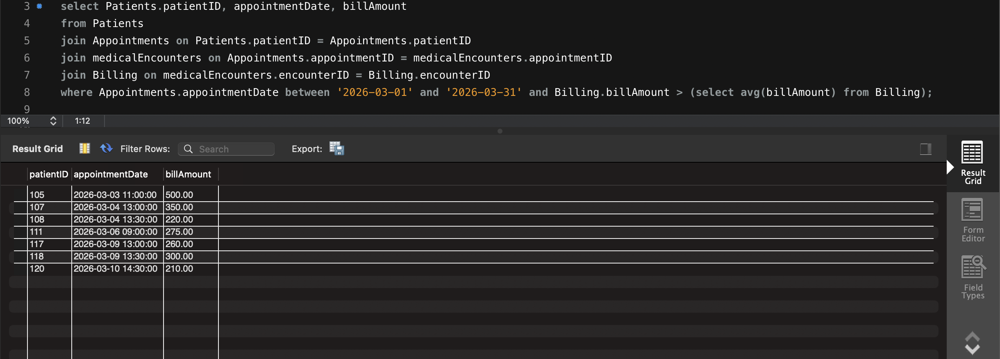

Query 1 shows all patients who have appointments scheduled in March 2026 that have a billing amount higher than average. This helps make sure to follow up with patients it returns that may make them more money.

## Query 2
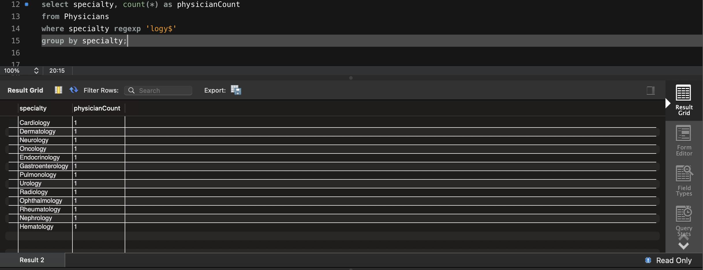

Query 2 shows all the departments that have the phrase ‘ology’ in their name. This helps management judge the size of each department. 

## Query 3
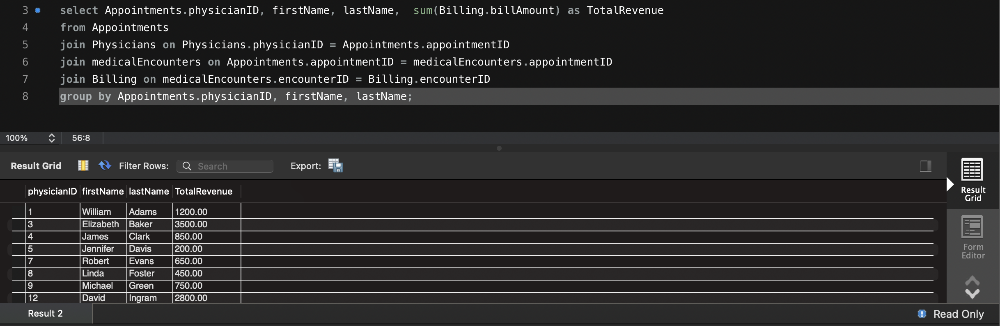

Query 3 shows the total amount billed by each physician. This allows the administration to track the revenue generation of individual practitioners and evaluate their financial contribution to the clinic. 

## Query 4

Query 4 lists all the dates of all the medical encounters that have not been paid for. This helps the billing department to identify lost revenue or patients who have received care but have not yet initiated a payment. 

## Query 5
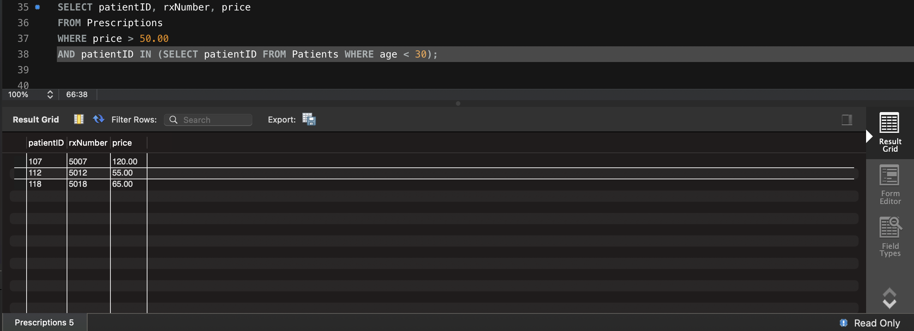

Query 5 shows which patients under 30 received a prescription that costs more than $50. This helps identify younger patient demographics that may require financial assistance or high-cost chronic care management.

## Query 6
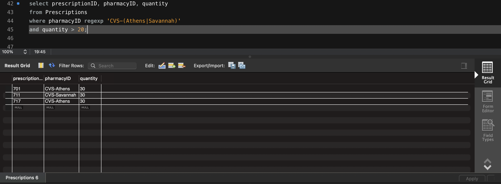

Query 6 shows which prescriptions were filled at CVS in Athens or Savannah with a quantity over 20. This query analyzes supply chain and pharmacy partnership volume in specific geographic regions.

## Query 7
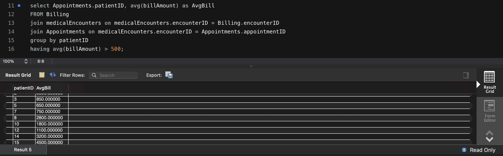

Query 7 shows which patients have individual bills that are larger than an average of $200.00. This query shows high-cost medical events that might trigger insurance audits or require specialized payment plans. 

## Query 8
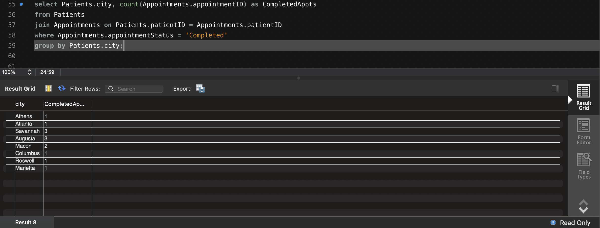

Query 8 shows which cities the patients are from that have completed appointments at the clinic. This query identifies locations where there are more patients so the clinic can know which areas the majority of the patients are from. 

## Query 9
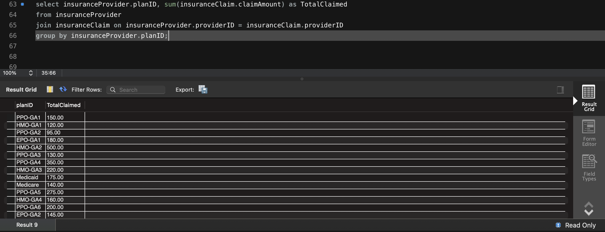

Query 9 shows the total claim amount associated with each insurance plan type. It evaluates which insurance plans are the most common within the practice to negotiate better provider rates. 

## Query 10
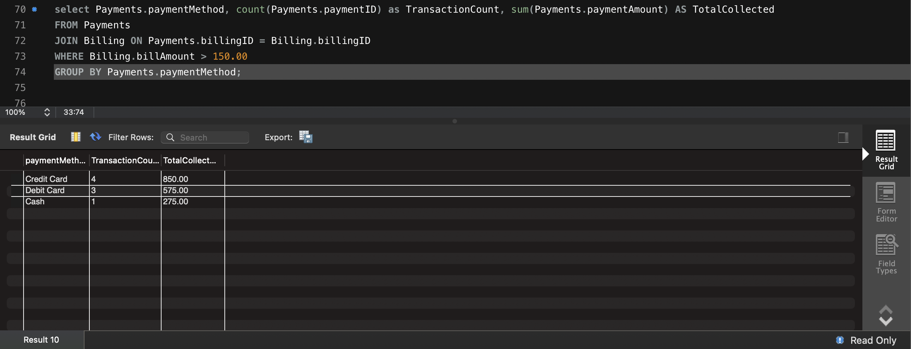

Query 10 shows the total amount paid per payment method for bills greater than $150.00. This helps management understand how patients prefer to settle larger balances (credit card vs. cash), which can influence decisions on payment processing fees and financial policies. 

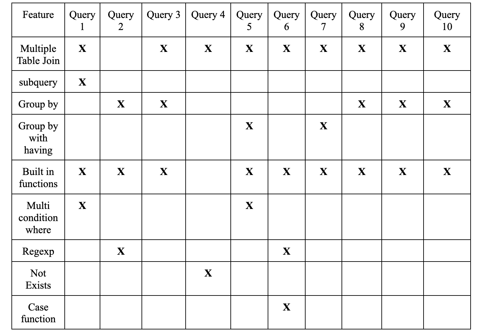

## Database information:
Name of the database: ns_ace57971

Additional information: Each query listed above is marked in the database using stored procedures which can be called using the following format: CALL TP_Q1();

