# MIST4610groupproject
Group 2

## Members:
1. Sean Donovan - [@sean4565](https://github.com/sean4565)
2. Aaron Eason - [@aceeason](https://github.com/aceeason)
3. Gilbert Fahnbulleh - [@gsf11597](https://github.com/gsf11597)
4. Navi Khan - [@NaviKhan15](https://github.com/NaviKhan15)
5. Kiera Lumley - [@ksl05149](https://github.com/ksl05149)
8. Steven Thomas - [@st11521](https://github.com/st11521)

## **Scenario Description**
Our groups task is to build a database to manage virtual clinic throughput and insurance reimbursment. The central entity of the model is the patients. The patients are the clients that the physicians manage. Patients can interact with the model two ways by booking virtual appointments, and by getting their appointments insured. Patients work conjuctively with physicians, appointments, medical encounters, prescriptions and insurance providers. Our group wants to accurately model the patient to medical system interaction, generate sample data, and create a model that manages these relationships. We are performing queries on this data to provide business insight about the telehealth patient and provider portal.

## **Explanation of Data Model**
Our data model is designed to capture operational flow of a virtual clinic with a focus on patients and insurance processes. At the center of the system is the Patients entity, serving as the foundation for most relationships in the model. Patients are able to interact with the system mainly by scheduling virtual appointments and by having those appointments processed for insurance reimbursement. This forms two one-to-many relationships, with one between Appointments and Patients, and another from Appointments and Physicians. These two also form a many-to-many relationship between Patients and Physicians, with Appointments acting as the associative entity, reflecting the reality that a patient can see multiple specialized physicians over time, while physicians can attend care to many different patients. Physicians can also maintain structured availability, represented by the one‑to‑many relationship between Physicians and Availability, which ensures that appointments can only be scheduled during valid time windows.

After an appointment occurs, it may generate a medicalEncounter, that connects back to Patients and appointments. Each encounter represents a documented interaction, driving several downstream processes in the model which record, bill, and support the clinical meeting. From there the model branches into documentation and treatment, where Encounters form a one to one relationship with medicalRecords, which could store diagnoses and clinical details from that encounter. Then the Encounter flows into the Billing process, which captures the amount, status, and date, creating a financial picture of the services delivered.

The billing record is the base for two major downstream components of Payments and insuranceClaims. Payments connect to patients in a one to many relationship where a patient may make pay off a bill over multiple installments, recording details such as the date, method and amount, allowing the system to track partial payments. Alongside payments, the model supports insurance reimbursement through the InsuranceProvider and InsuranceClaim entities. Patients may have multiple insurance plans on file, and each billing record can generate one or more claims, reflecting real-world scenarios where primary and secondary insurance coverage may both be involved. Insurance claims store the claim type, claim amount, and the provider responsible for reviewing the claim. As each claim moves through stages such as submission, processing, approval, or denial, its outcome directly influences whether the associated bill is fully paid, partially covered, or left outstanding. 

## **Core Entities:**
1. Appointments
2. Availabilty
3. Billing
4. insuranceClaim
5. insuranceProvider
6. medicalEncounters
7. medicalRecords
8. Patients
9. Payments
10. Physicians
11. PhysicianSpecialty
12. Prescriptions
13. Specialty

## Database Model
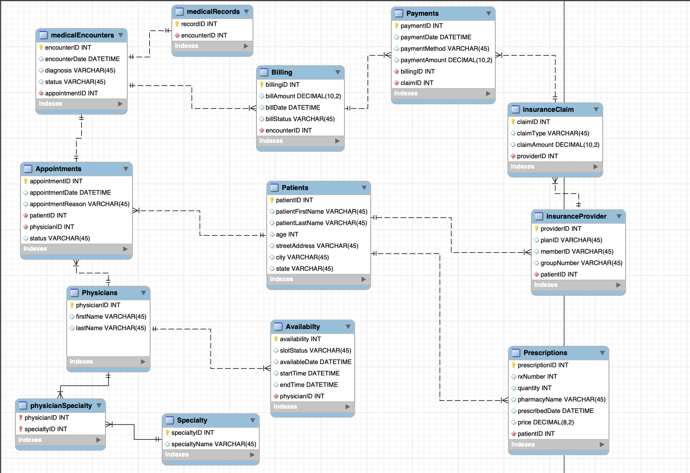

## Data Dictionary 

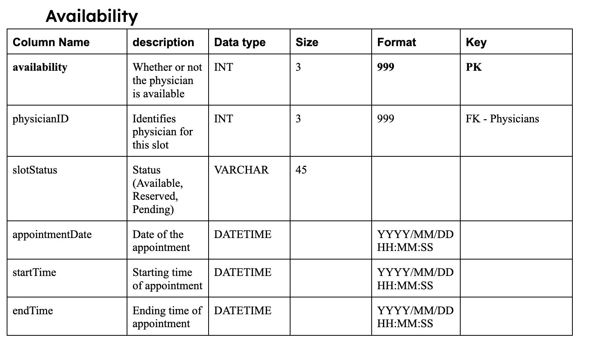

## Query 1
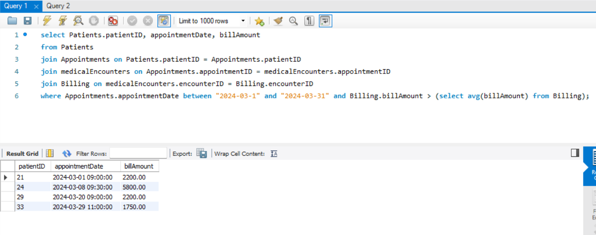

Query 1 lists all patients in the Telehealth Clinic that visited during the month of March while also having a billing amount higher than the overall average billing amount in the system.

This query allows management to see which patients received more complex care. We are assuming that the higher the bill, the more tests or complex care that is required for a patient. Management can then be involved in more care by having a dedicated care coordinator that knows all about the patient's case to assign the correct specialists, routine follow-up checks, and daily health problems. 

## Query 2
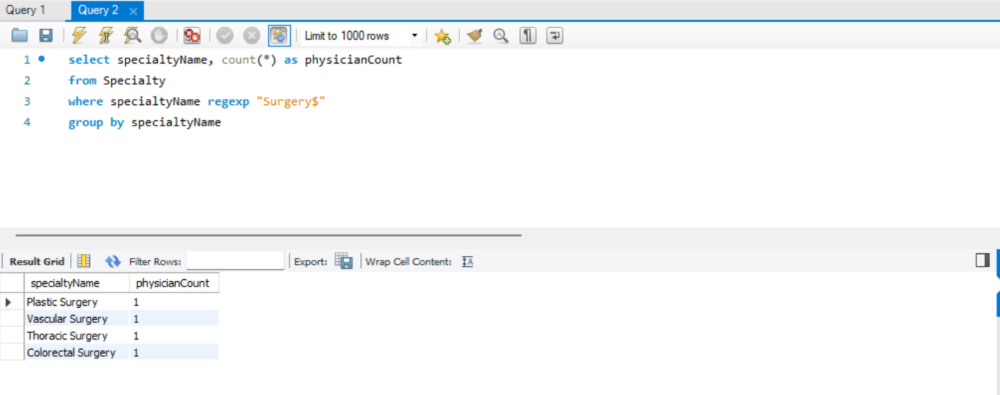

Query 2 shows all the specialties that have the phrase ‘Surgery’ at the end of their name and the amount of Physicians in each Surgery Specialty. 

We know that we have all Surgery specialties as surgery follows the specialty in the data. This allows management to know exactly how many surgeons they have. With this data, the clinic can expand strategically. They can become more of a specialty clinic by hiring more of the same specialties or they can bring in different types of specialties therefore increasing the types of patients coming to the clinic. 

## Query 3
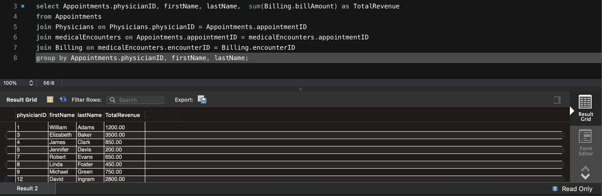

Query 3 lists out all patients ID, their first and last name, and the revenue that they generate. This can be used to track how much revenue each individual client generates. 

Management could use this information to see high cost clients, and give them specialized care for how much money they are spending. Managers could continue to track this data to see why clients are generating so much revenue, and if it increases or decreases over time. 

## Query 4
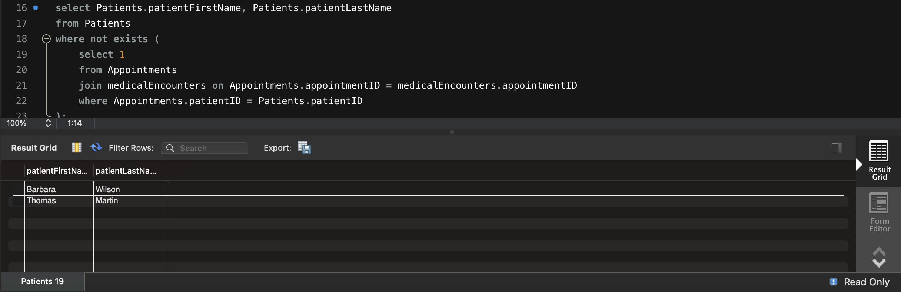

Query 4 lists and identifies names of the patients who have not yet attended their scheduled appointment. This provides insight to the individuals who are registered to the system but have not completed their visit yet. 

By tracking this group, management can better understand the new pool of patients and take measures to encourage them to attend. They may send appointment reminders, follow up with communications, etc. Leveraging this data improves the efficiency of the schedule and potentially foster long-term relationships with clients.

## Query 5

Query 5 identifies patients under the age of 30 who have received prescriptions costing more than $50, while also calculating the total number of prescriptions, total spending, and average prescription cost per patient.

This query helps clinic management to identify younger patients who may be experiencing higher medication costs. By summarizing total and average spending, this provides a clear picture of the financial burden within this demographic. In a virtual clinic setting this insight is valuable for guiding outreach, such as offering cost-saving alternatives, financial assistance resources, or additional consultation. This allows the virtual clinic to be more proactive in addressing potential challenges, improving both patient satisfaction and long term health outcomes. 

## Query 6

Query 6 identifies prescriptions filled at CVS pharmacies and categorizes them into risk levels of “High,” “Moderate”, or “Normal” based on the quantity of medication prescribed. It also provides key patient details including name, age, and prescription information. 

This query enables management to monitor prescription patterns associated with larger medication quantities, which can indicate higher usage, chronic conditions, or potential misuse. By focusing on a specific pharmacy group, the clinic can also track partnerships or trends tied to that provider. This insight is valuable for triggering follow ups, ensuring appropriate medication use, and improving patient safety through personalized care and oversight.

## Query 7
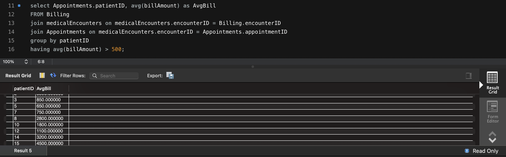

Query 7 shows which patients have individual bills that their historical average bill amount is larger than $500.

This shows management a person that could need extra help with their payment plans or coordination of care. Management can also accurately look at potential future revenue. Since this shows historical data, we know that these patients normally have higher costs and can bring in more money to the clinic. 

## Query 8
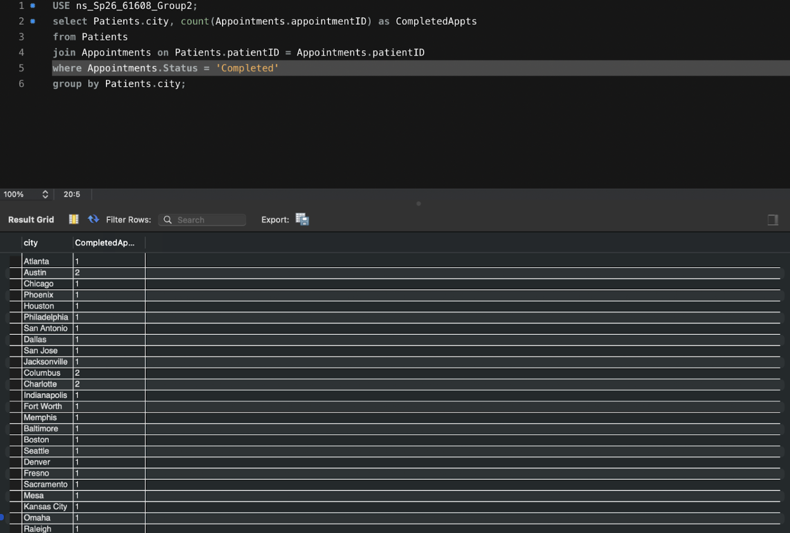

Query 8 shows which cities the patients are from that have completed appointments at the clinic. 

This query identifies locations where there are more patients so the clinic can know which areas the majority of the patients are from. It can help so that they can increase the size of the clinics in those locations. More patients equals more money for the clinic in the long run. So, it is very strategic to look at where the most completed appointments are located. 

## Query 9
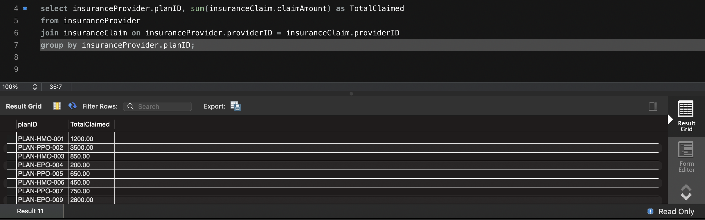

Query 9 determines which insurance plan types contribute most significantly to overall revenue. It calculates the total claim amount associated with each plan category. The results show a breakdown of revenue distribution across different insurance types.

The data can allow management to identify the higher value plans based on both utilization and financial impact. With this information, management can prioritize relationships with the most profitable insurance providers and develop more informed negotiation strategies. Additionally, understanding the revenue trends would help the clinic have better financial planning, resource allocation, and make better decisions within the organization.

## Query 10
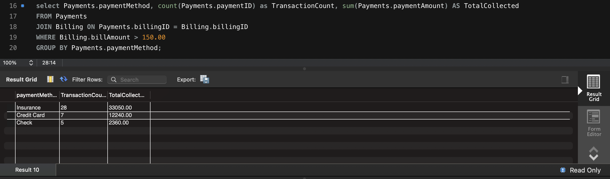

Query 10 examines the total transactions and amount collected by payment method for bills greater than $150.00. 

This helps management understand patient payment preferences for larger balances. Decisions about processing fees, payment guidelines, and the best ways to collect revenue can all be affected by this information. You want to make sure the clinic makes a profit but also that the patients want to keep coming back to your clinic. 

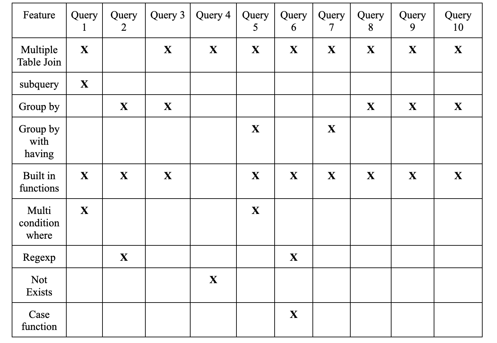

## Database information:
Name of the database: ns_Sp26_61608_Group2

